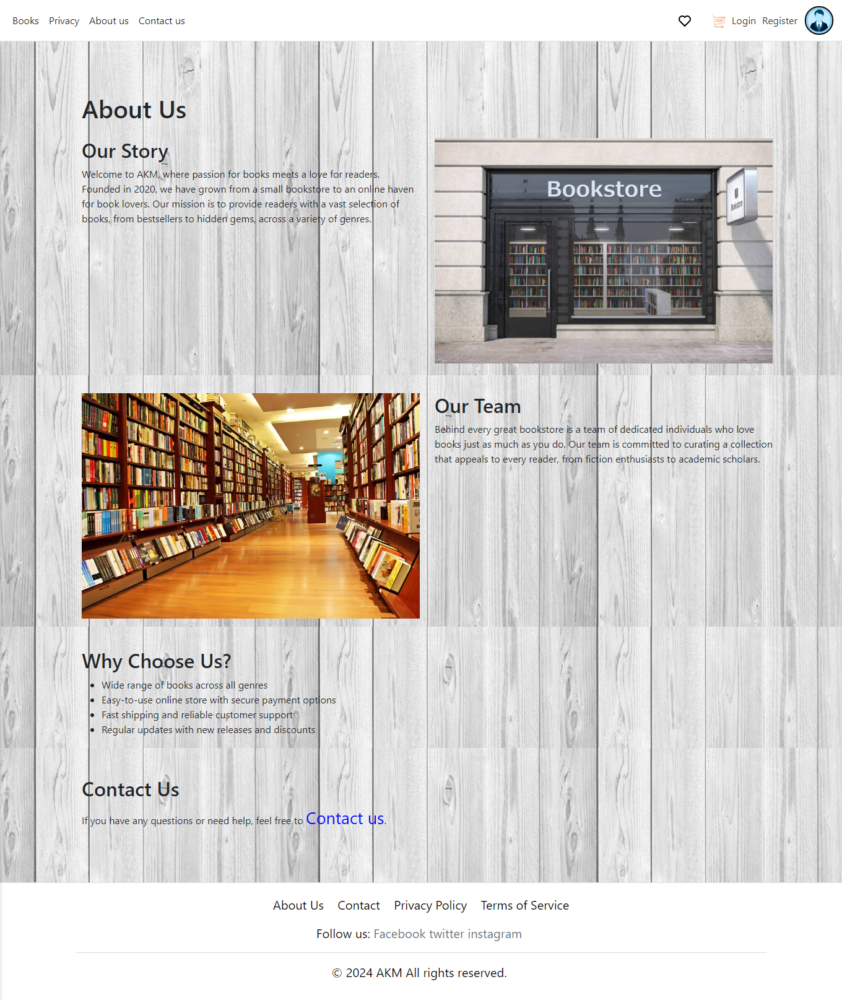

<!-- # 📚 MVC Book Store

[]
[]
[]

## 📌 Table of Contents

- [Overview](#overview)
- [Demo](#demo)
- [Features](#features)
- [Tech Stack](#tech-stack)
- [Getting Started](#getting-started)
- [Usage Examples](#usage-examples)
- [Project Structure](#project-structure)
- [Contributing](#contributing)
- [License](#license)

## 🔍 Overview

This is a responsive Online Book Store built using **ASP.NET MVC**.
Users can browse, search, manage carts, and purchase books online.
Admins can handle inventory and orders through a secure dashboard.

## 🎬 Demo

Visual walkthrough of the application:

- **Home page & search** – browse by category and search for titles
- **Book details** – view price, author, and availability
- **Cart & checkout** – add/remove items and place orders
- **Admin dashboard** – manage books and orders

### 🏠 Homepage


### 📖 Book Details



### 🛒 Cart and Checkout


### ⚙️ Admin Dashboard


_(See screenshots above)_

## ✅ Features

- Browse books by **category**, **author**, or **publisher**
- **Search** functionality with keyword matching
- **Detailed book view** with pricing and stock status
- **Shopping cart**: add, remove, and list books
- **Checkout process** with order creation
- **User authentication & roles** (`Admin`, `User`)
- **Admin portal**: manage books, categories, and orders
- **Responsive UI** using Bootstrap & jQuery
- **Server-side validation** & error handling

## 🧰 Tech Stack

- ASP.NET MVC (.NET 8)
- C#
- Entity Framework Core
- SQL Server
- Razor Views, HTML/CSS
- Bootstrap 5
- JavaScript / jQuery

## 🚀 Getting Started

```bash
git clone https://github.com/USERNAME/REPO.git
cd REPO
dotnet ef database update
dotnet run
``` -->

[](https://deepwiki.com/nagy20190/BooKStore-MVC)
